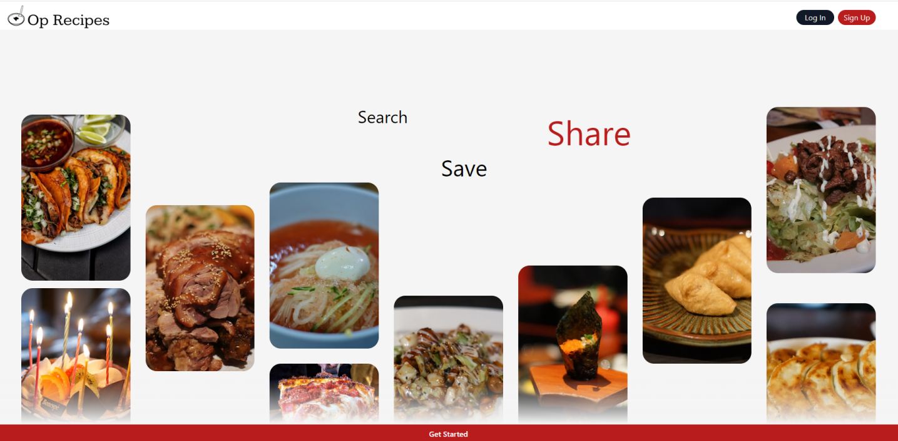
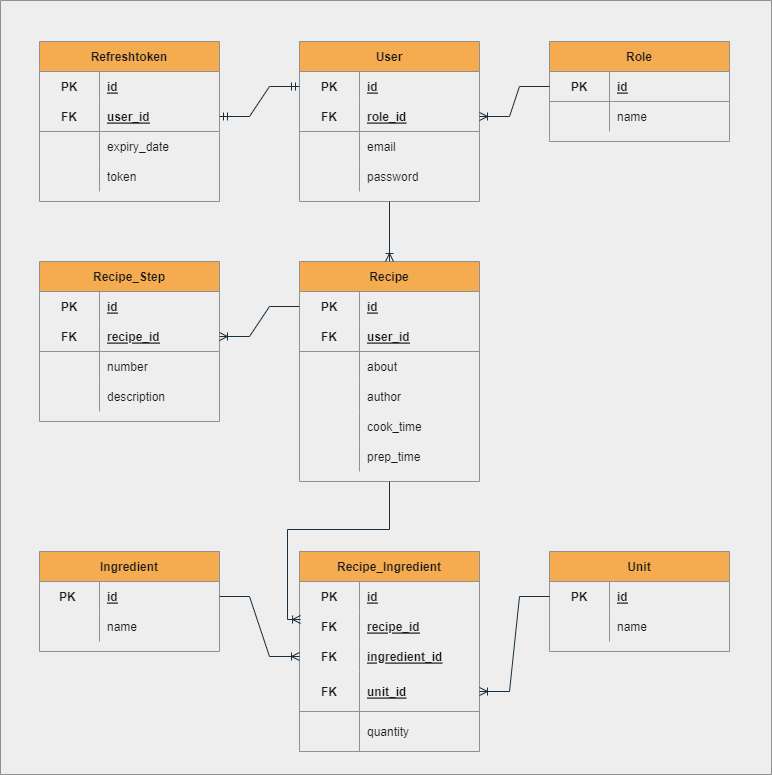
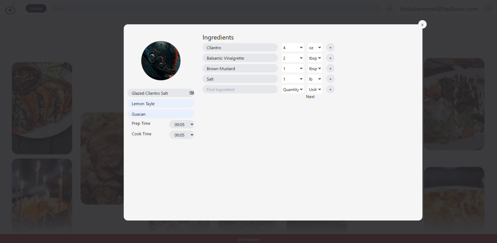

  
  
# Op Recipes
  
Search for new recipes. Save your favourites. Share your creations</a>

  

    
Table of Contents

    <ul>
      <li><a href="about">About</a></li>
      <li><a href="technical-specification">Technical Specification</a></li>
      <li><a href="schema">Schema</a></li>
      <li><a href="next-steps">Next Steps</a></li>
    </ul>
  

## About

 Conceived in hunger, and executed during long nights, Op Recipes is a skeleton of what will eventually become the next best recipe app. For the moment it exists primarily in a form that satisfies the requirements of the TekSystems bootcamp capstone. Users can login, create new recipes, and view their saved recipes. The idea was inspired by my wife's request to have somewhere to save our recipe collection by taking photos of the recipe and having it automatically read and saved. We're not quite there yet, but we've got a pseudo working something here! 

## User Stories

Prime User: I want an app that can store recipes from photos so that I can clean up our loose-leaf recipe collection. 

Standard User: I want to be able to save recipes online so that I can fetch them from anywhere. 

Pinterest Power User: I want to be able to search for recipes and save them to collections so I can always have my favorite recipes on hand.

 

## Technical Specification

### Frontend
* HTML
* CSS
* Javascript 
* ReactJS
* Tailwind

### Backend
* Java
* Maven
* Spring Boot
  - Spring Data
  - Spring Security
  - JSON WebToken
* JUnit 5
*MariaDB

## Schema

## Next Steps

What we have currently is a pretty threadbare representation of what will be. Some things I'm working on going forward are:

* Flesh out user profiles
* Implement masonry style search page.
* Implement search function.
* Add search filter box
* Enable liking and saving recipes
* Implement recipe collections
* Add responsive design to pages
* Learn NLP and image recognition
* Design a systemt to read recipe images and extract relevant information.

